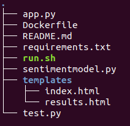

# HuggingText

**HuggingText** is a simple Python API for classifying and analysing sentiment in text. It depends on the PyPi package `germansentiment` at a backend to detect sentiment in German texts. The `germansentiment`itself is build on top of BERT architecture open sourced by Huggingface. 

For more detailed read please visit [germansentiment](https://pypi.org/project/germansentiment/) and [BERT HuggingFace](https://huggingface.co/transformers/model_doc/bert.html)     

### Getting started

In order to package the HuggingText in Docker, you'll need docker installed.

Please visit and download the Docker for your preferred operating system at [Linux, MacOS, Windows](https://docs.docker.com/get-started/)

### Project setup



The `germansentiment` model/inference code is stored at `sentimentmodel.py` and the web api code is under `app.py`.

In addition, the project has api test module `test.py`, `Dockerfile` which include commands to build and run the container and a `requirements.txt` file to setup the virtual environment.

### System configuration

For quicker inference, I use NVIDIA CUDA base images for the container and the system configuration is

OS: Ubuntu20.4

GPU: NVIDIA GeForce GTX 1060Ti

CUDA: 11.4

CUDNN: 8.0

### Build and Run Docker Container
```sh

git clone https://github.com/Saran-nns/HuggingText.git

cd HuggingText

sh run.sh
```

In case you would like to build container manually,

```sh

docker build -f Dockerfile -t huggingtext:v0.1.0 .

```
and to run the container,

```sh

docker run -p 8000:5000 -v /home/saran/huggingtext/:/root/huggingtext -ti huggingtext:v0.1.0 /bin/bash -c "cd /root/huggingtext/ && source activate huggingtext && python app.py" 

``` 
Note that port 8000 from docker container is listening to port 5000 from the flask app. Therefore, to access the app please visit http://127.0.0.1:8000

### TODO:

To deploy the containerized app to GCP,
  - Cloud Build and Container Registry
  - Cloud Run
